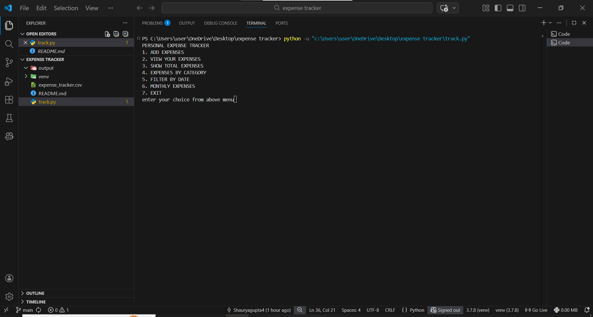
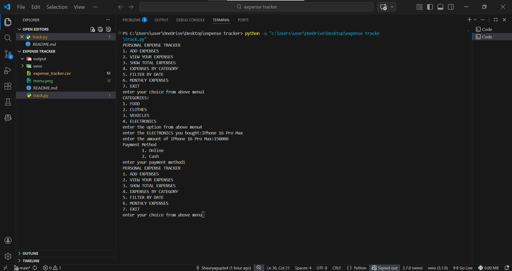
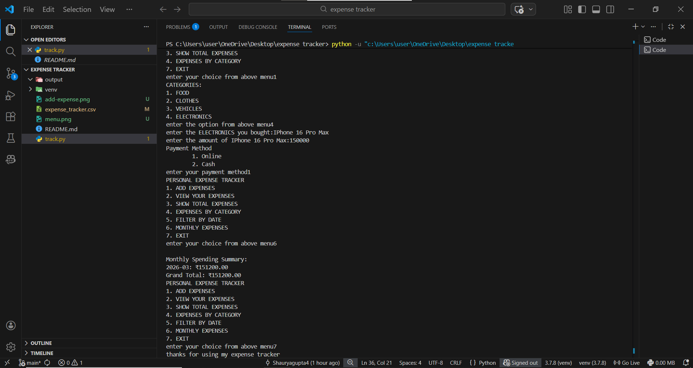

# Personal Expense Tracker (Python Console App)

A simple yet complete expense tracking application built with Python and Pandas.  
Perfect for beginners to practice data handling, file I/O, input validation, and basic data analysis.

## Features
- Add expenses with auto date, category, item, amount, and payment method (Online/Cash)
- View all expenses (numbered list)
- Show total spending
- Filter expenses by category
- Filter by exact date
- Monthly spending summary + grand total

## Tech Stack
- Python 3
- Pandas (CSV read/write, groupby, datetime parsing)
- os & datetime modules
- Input validation with try-except

## How to Run
1. Clone the repo: https://github.com/Shauryagupta4/personal-expense-tracker-python.git
2. Install dependencies: pip install pandas
3. Run the app: python_track.py or whatever your file name is

## What I Learned (as a 1st-year CSE AIML student)
- Proper CSV header handling (create once, append without header)
- Refactoring duplicated code using dictionaries
- Pandas groupby for monthly summaries
- Error handling with ValueError
- Git & GitHub basics for version control

## Future Plans
- Add pie chart visualization with Matplotlib
- GUI version using Tkinter or Streamlit
- Delete/edit expenses
- Simple ML spending prediction

## Screenshots

Built with ❤️ by Shaurya  
March 2026
